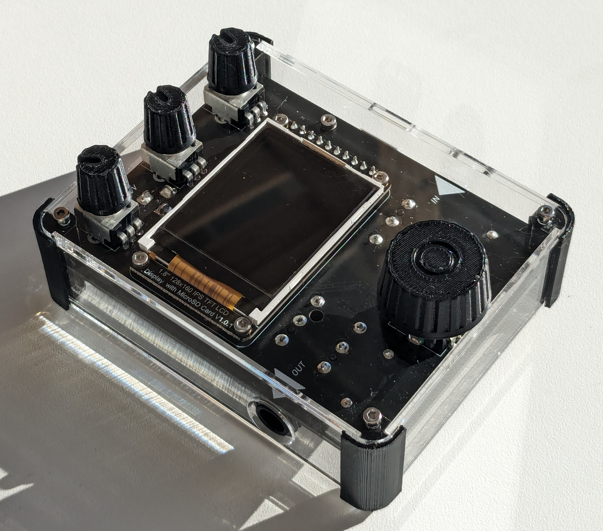
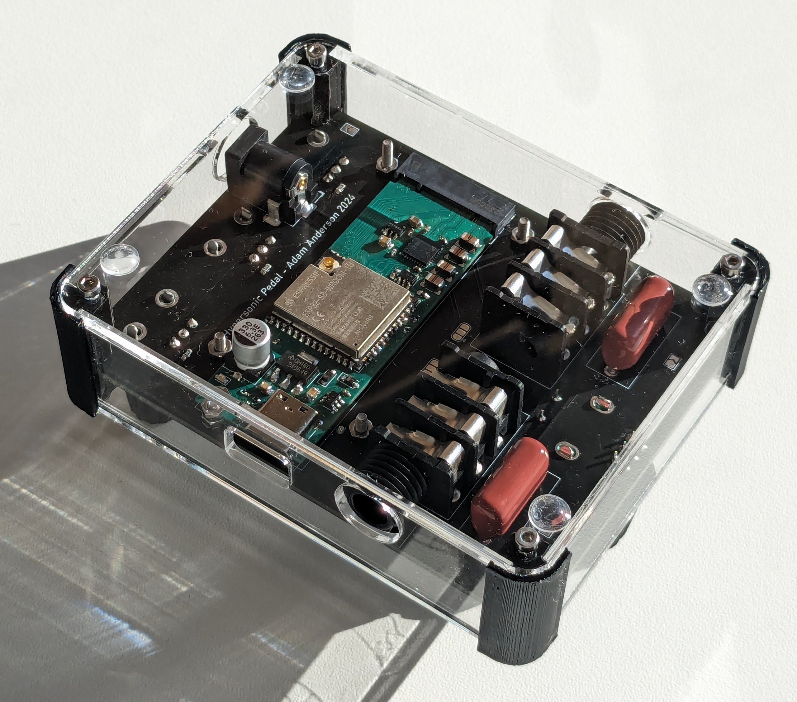

# Hypersonic
Platform for audio development with ESP32-S3, Work in progress.

Design goals: 
Modularity. Flexibility. High Fidelity. 

Based on previous project: [Supersonic Quantumbox](https://github.com/GustavAbrahamsson/Supersonic-Quantumbox)

## Development progress:

### Hardware
- [x] ESP32-s3 + CODEC module ([`/Hypersonic_pcb`](./Hypersonic_pcb/))
- [x] Pedal with screen, potentiometers, and connetors. ([`/Hypersonic_pedal_pcb`](./Hypersonic_pedal_pcb/))
- [x] Assembled
- [ ] Fully tested

### Software
- [x] Peripheral drivers
- [ ] FreeRTOS system
- [ ] User interface

### Effects

- [x] Saturation (Overdrive/Fuzz)
- [x] VU meter
- [ ] Linear filters
- [ ] Compression
- [ ] Rotary speaker
- [ ] Wah-wah
- [ ] Echo/Reverb

